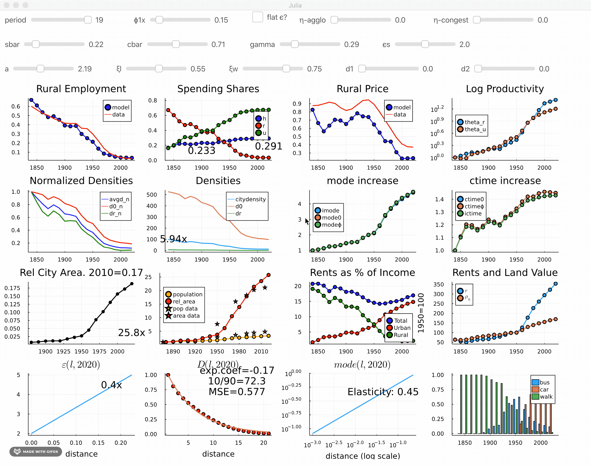

# Interacting with the Model

The package provides an intuitive way to interact with the model. Using [`Interact.jl`](https://github.com/JuliaGizmos/Interact.jl), we provide two dashboard views of both single region and country models. This is helpful to understand comparative static changes of a single parameter change.

## `Dashboard`s

Both region and country have an associated `dashboard` function which outputs a plot with multiple panels. The [`dash`](@ref LandUse.dash) function for example prints a quick dashboard for a single region:

```@example 3
using LandUse   # hide
using NNlib, Flux # hide
LandUse.dash(5)
LandUse.savefig("single-dash.png")
```   


Similarly, the country dashboard for a 3-region country in period 5 can be obtained via

```@example 3
LandUse.cdash(3,5)
LandUse.savefig("k3-dash.png")
```   


## Interaction

The main interaction function is

```@docs
LandUse.i0
```

and it opens a `Blink.jl` window like this one:



The multi region version is 